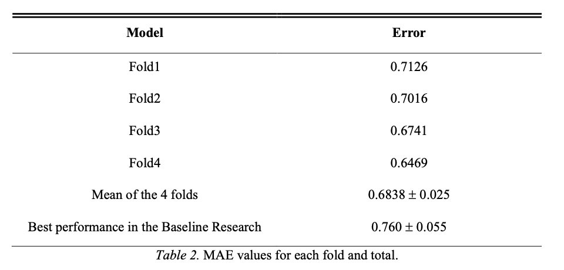
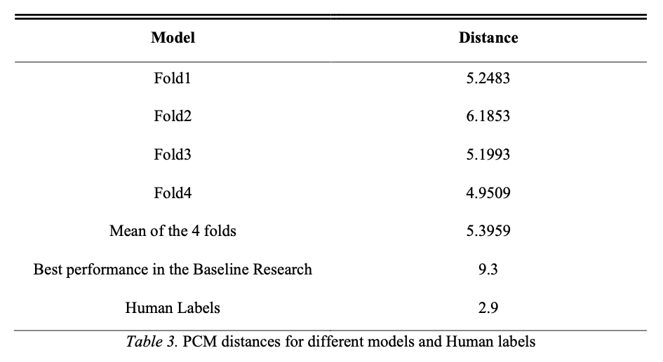
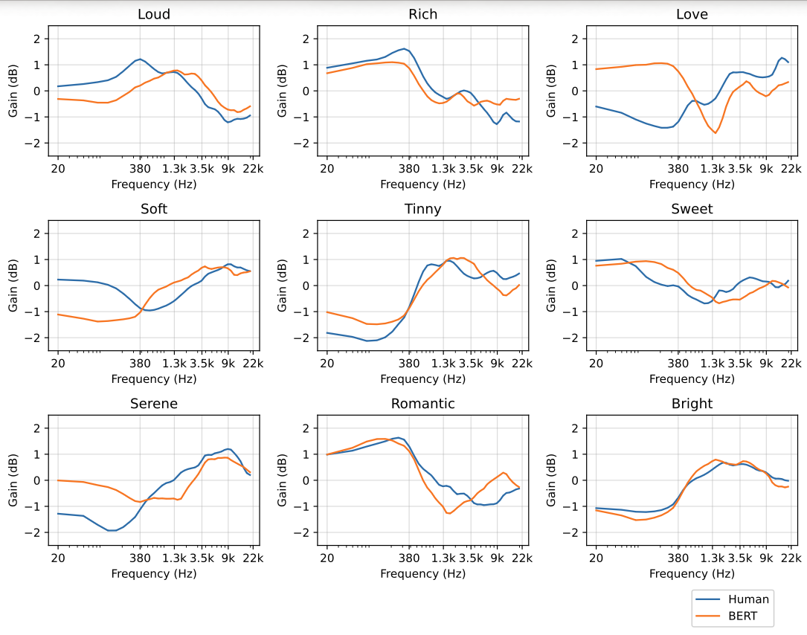
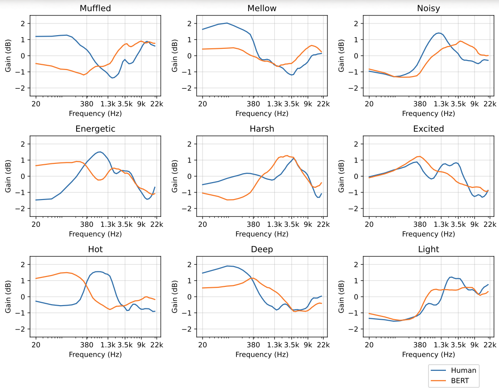
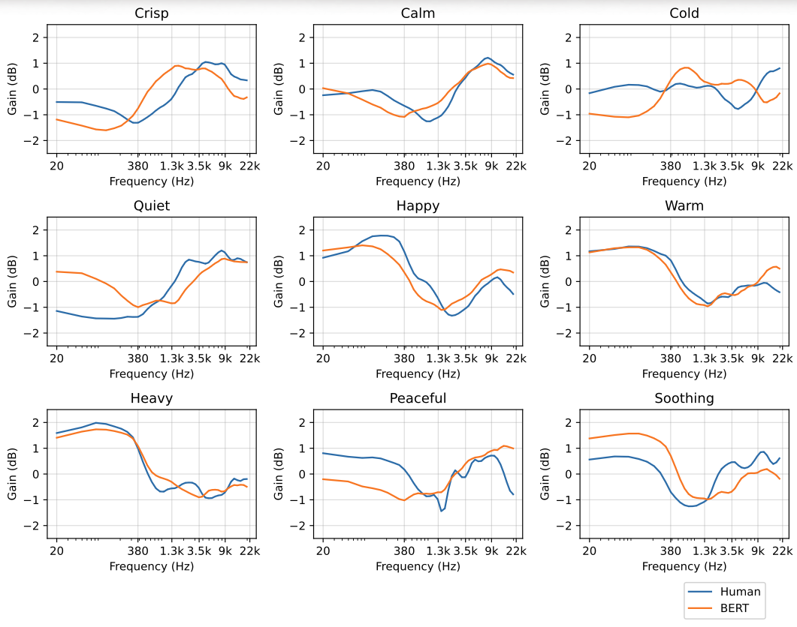
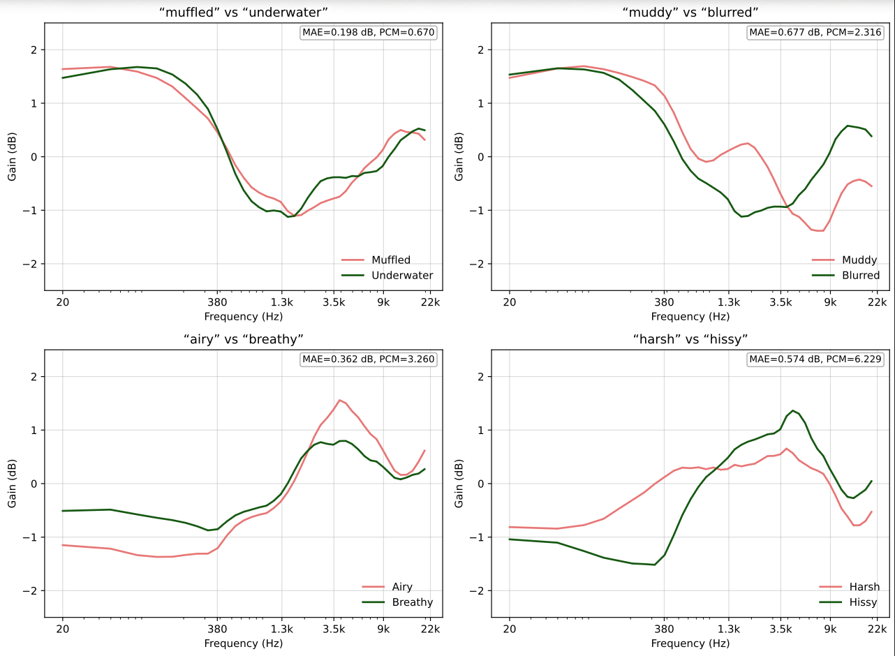
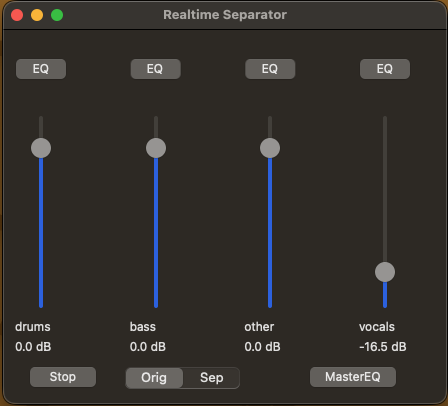
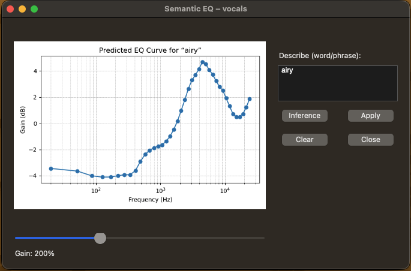
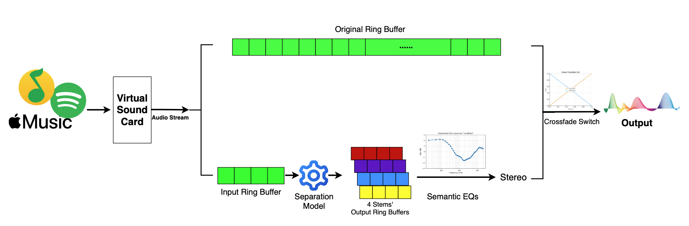

# Bert-Driven-Equalizer

A **semantic EQ**: turn natural language descriptors into automatic equalization curves.  
This project is part of an in-progress Master’s thesis exploring **BERT contextual embeddings + regression → 40-band EQ curves**.

---

## Quick Overview

Describe how you want the sound to change (e.g., *warm*, *bright*, *muddy*), and the model predicts a full **40-band ERB EQ curve** to match that descriptor.  
You can run it with the provided notebooks and preview results in this repo.

---

## 🔍 Baseline Research
Part of this project and codes are based on the research by Venkatesh et al. (2022), which explores using word embeddings for automatic equalization in audio mixing.  
You can read the original paper: [*Word Embeddings for Automatic Equalization in Audio Mixing*](https://arxiv.org/abs/2202.08898).

---

## 📄 SocialEQ Dataset
- You can get the SocialEQ dataset from [here](https://www.dropbox.com/scl/fo/ulk8t7ad5b1js8qwuph3f/ANnatQNiD1QoQoeDDZktHjM/data/raw?e=1&preview=eq_contributions.csv&rlkey=we20hw9qu94wytocopw5np1yj&subfolder_nav_tracking=1&dl=0).

---

## Files

- **Notebooks**  
  - `Play_and_Listen.ipynb` – quick demo + interactive inference  
  - `ModelTraining&Testing.ipynb` – train / evaluate  
  - `Embedding-extraction.ipynb` – BERT embedding extraction  
  - `data-preprocess.ipynb` – data setup (SocialEQ dataset)

- **Models**  
  - `BERT_*Fold_MAE.keras` – saved checkpoints

- **Results/** – figures from the experiments  
- **App/** – prototype application UI & screenshots  
- `e_gtr_short.wav` – sample audio

---

## Run It

1. Open **Play_and_Listen.ipynb**
2. Load a model checkpoint (e.g., Fold 4)
3. Enter a descriptor (text)
4. Hear the equalized audio

---

## Results

Below are the key **Results** showing model performance and example predictions.

### MAE & PCM Results vs Baseline

*Mean Absolute Error per band across folds*

*Partial Curve Mapping distance across folds*

### Predicted Curve vs Human Curve

### Domain-Specific Understanding Tests

---

## Application (Prototype)

### Main View

### Descriptor Input & Curve Preview

### Workflow

---

